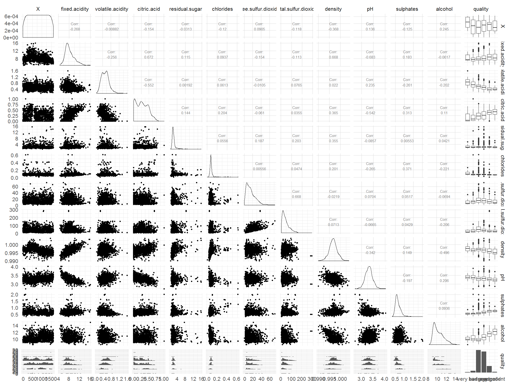

P4 - Red Wine Quality - Exploratory Data Analysis by S.Jaeger
========================================================


```{r echo=FALSE, message=FALSE, warning=FALSE, packages}
# Load all of the packages that you end up using in your analysis in this code
# chunk.

# Notice that the parameter "echo" was set to FALSE for this code chunk. This
# prevents the code from displaying in the knitted HTML output. You should set
# echo=FALSE for all code chunks in your file, unless it makes sense for your
# report to show the code that generated a particular plot.

# The other parameters for "message" and "warning" should also be set to FALSE
# for other code chunks once you have verified that each plot comes out as you
# want it to. This will clean up the flow of your report.

library(ggplot2)
library(plyr)
library(dplyr)
library(GGally)
library(gridExtra)
theme_set(theme_minimal(20))
```

```{r echo=FALSE, Load_the_Data}
# Load the Data
wqr<-read.csv("wineQualityReds.csv", sep=",")
head(wqr,3)
```

As the X variable is useless here (it is only a list of indexes of the observations), I propose to remove it.

```{r}
#Nulling X variable
wqr$X <- NULL
```

> **Note**: As stated in Udacity's data option page [1], this tidy data set contains 1,599 red wines (of the Portuguese "Vinho Verde") with 11 variables on the chemical properties of the wine. At least 3 wine experts rated the quality of each wine, providing a rating between 0 (very bad) and 10 (very excellent). This data has been collected and made available by a scientific study from [Cortez et al., 2009].
The main guiding question through my exploration of this data will be <b>Which chemical properties influence the quality of red wines?</b>

# why did I choose this dataset ?
Probably because as many French native, I love wine. I love speaking, seeing, smelling and of course tasting wine, especially when it comes associated with a good meal. However I am afraid I don't know much about the chemical properties of wine, except may be some rumor that states that wine having a lot of sulphates might cause severe headache the day after :o).
If like me you are interested in learning about wine, I just can not resist in introducing "The drops of God" by Tadashi Agi ("Les Gouttes de Dieu" in French):<BR>


This Japanese Manga is perfect to learn more about wine without getting too serious. At the end of each volume of this comic strip, the author includes an additional leaflet describing each specific wine mentioned in the story. Besides, it covers wines from all over the world. I encourage you in reading those books ! <BR>
 

# Univariate Plots Section

> **Note**: In this section, we will explore the data focusing on a single variable.

As we are interested on how different chemical factor influence the quality of wine it sounds sensible to have a detailed look at the quality variable.

```{r}
#Basic statistics
summary(wqr$quality)
```
Wine quality ranges from 3 (Min quality) to 8 (Max quality), With first quartile at 5 & 3rd at 6. 

```{r}
#Standard Dev.
sd(wqr$quality)
```

Standard deviation is 0.8 on a scale from 3 to 8, this means that there is a low variance, and that a lot of records in a range of [-0.8, 0.8] around the mean, that is between [4.8, 6.4] (As quality is expressed as an integer, is shall rather be between [5, 6].

```{r echo=FALSE}
#Here, factor(0) is provided as qplot syntax demands an x, not relevant in this case
#cf http://stackoverflow.com/questions/15027659/how-do-you-draw-a-boxplot-without-specifying-x-axis
qplot(x= factor(0),y = quality, data=wqr, geom="boxplot")
```

We can see that quality 3 and 8 are considered as outliers, which means that there must be very few of them.  
Let us verify all those hypothesis by looking at the distribution of wine quality:
For readability, it will be more comfortable to convert the wine quality expressed as a digit between 3 & 8 as a factor.

```{r echo=FALSE, Univariate_Plots}
str(wqr)
#Turning wine quality as a factor
#As per the paper, grading ranges from 0 (worse quality) to 10 (best quality)
#But the dataset only ranges from 3 to 8
wqr$quality<-factor(wqr$quality, levels = c(3,4,5,6,7,8), 
                    labels = c("very bad\n(3)","bad\n(4)","average\n(5)",
                               "good\n(6)","very good\n(7)","excellent\n(8)"))                               

#Plotting quality
qplot(x = quality, data=wqr,fill=I('#099DD9'))
```
```{r}
#Getting histogram exact values
table(wqr$quality)
```

Let us have a look at all other variables:
```{r}
#Plotting fixed acidity
qplot(x = fixed.acidity, data=wqr,fill=I('#099DD9'),binwidth=0.3)
```

Fixed.acidity has a long tailed distribution.

```{r}
#Plotting volatile acidity
qplot(x = volatile.acidity, data=wqr,fill=I('#099DD9'),binwidth=0.04)
```

Volatile.Acidity looks like a bimodal distribution.

```{r}
#Plotting citric.acid
qplot(x = citric.acid, data=wqr,fill=I('#099DD9'),binwidth=0.04)
```
```{r}
#Using freqpoly to better visualize variations
qplot(x=citric.acid,data=wqr,binwidth=0.01,geom = "freqpoly")
```

Citric.acid distribution is generally decreasing with a few peaks at 0, 0.25 & 0.5.


```{r}
#Plotting residual sugar
qplot(x = residual.sugar, data=wqr,fill=I('#099DD9'),binwidth=0.1)
```
 
 Residual.sugar is normally distributed but skewed with a lot of outliers on the right. Let us improve this plot by removing outliers on the right.
 
```{r}
#Plotting residual sugar removing 10% of outliers on the right 
#and a very little on the left
ggplot(aes(x=residual.sugar, fill=I('#099DD9')), data = wqr) +
        geom_histogram(binwidth=0.1)+
  xlim(quantile(wqr$residual.sugar, 0.001),quantile(wqr$residual.sugar, 0.9))
```

The 1st plot has been used as input for the reframing of the second plot. I found it relevant to stripe the 10% outliers on the right and a very few of them on the left to retrieve a normal distribution centered around 2.
 
 
```{r}
#Plotting chlorides
qplot(x = chlorides, data=wqr,fill=I('#099DD9'),binwidth=0.01)
```

Chlorides are normally distributed with a lot of outliers on the right. Let us repeat previous process and remove outliers to get a better view.

```{r}
#Plotting residual sugar removing 10% of outliers on the right 
#and a very little on the left
ggplot(aes(x=chlorides, fill=I('#099DD9')), data = wqr) +
        geom_histogram(binwidth=0.005)+
  xlim(quantile(wqr$chlorides, 0.001),quantile(wqr$chlorides, 0.95))
```

Again, removing the outliers (5% on the right, a few ones on the left) enables to get a much better view on the distribution.

> **Note**: Although we are within the univariate section, I find relevant in this special case to overlay histograms as they are related to the same chemical properties (total & free sulfur.dioxyde). Even if one could argue that such a plot would be technically bivariate since it contains two different variables.


```{r}
#Plotting sulfur.dioxyde, overlaying total & free
ggplot(wqr)+
  geom_histogram(aes(x=free.sulfur.dioxide,fill='r'),alpha=0.5, binwidth=1)+
  geom_histogram(aes(x=total.sulfur.dioxide,fill='b'),alpha=0.5, binwidth = 1)+
  labs(x="Sulfur (mg / dm^3)")+
  scale_fill_manual(name="Sulfur", values=c("r" = "red", "b"="blue"), labels=c("b"="Total", "r"="Free"))
  
```

free.sulfur.dioxide & and especially total.sulfur.dioxide have almost a normal distribution but are long tailed on the right. Let us visualize them with a log10 scale to retrieve a more normal distribution.

```{r}
#Plotting sulfur.dioxyde, overlaying total & free with log10scale
ggplot(wqr)+
  geom_histogram(aes(x=free.sulfur.dioxide,fill='r'),alpha=0.5, binwidth=.1)+
  geom_histogram(aes(x=total.sulfur.dioxide,fill='b'),alpha=0.5, binwidth = .1)+
  scale_x_log10()+
  labs(x="Sulfur (mg / dm^3)")+
  scale_fill_manual(name="Sulfur", values=c("r" = "red", "b"="blue"), labels=c("b"="Total", "r"="Free"))
```

This graph is very useful to highlight something odd that I can not explain:<BR>
I would expect the Free quantity of Sulfure to be fully included within the Total quantity of Sulfur (attention has been paid to the measuring units that are identicals for both variables), which is not the case here.
Instead, We see two normal distribution having roughly the same characteristics, but the total one being shifted on the right.

```{r}
#Plotting density distribution
qplot(x = density, data=wqr,fill=I('#099DD9'),binwidth=0.001)
```

Density has a beautiful normal distribution centered around 0.998.

```{r}
#Plotting pH distribution
qplot(x = pH, data=wqr,fill=I('#099DD9'),binwidth=0.05)
```

pH has a beautiful normal distribution centered around 3.25.

```{r}
#Histogram of sulphates
qplot(x = sulphates, data=wqr,fill=I('#099DD9'),binwidth=0.05)
```

Sulphates has a normal distribution centerd around 0.6 with a lot of outliers on the right.

```{r}
#Histogram of alcohol
qplot(x = alcohol, data=wqr,fill=I('#099DD9'),binwidth=0.5)
```

Alcohol distribution has a peak at 9.5 and is then decreasing until 14.


# Univariate Analysis

### What is the structure of your dataset?
The data set is made up of tabular data, for a sample of 1599 red wines (observations). For each wine, the quality has been assessed and graded by professional taster, between 3 and 8. Other variables represent the wine index (X) and many of its chemical properties.
From the histogram, we can see that quality has a normal distribution and that most   of the wines 75% (1200/1600) range in the middle of the distribution, whilst a very few of them range in the excellent or very bad qualities (outliers). 
Standard deviation is 0.8 on a scale from 3 to 8, this means that there is a low variance, and that a lot of records in a range of [-0.8, 0.8] around the mean, that is between [4.8, 6.4] (As quality is expressed as an integer, is shall rather be between [5, 6] which confirms previous observation.


### What is/are the main feature(s) of interest in your dataset?
The main feature of interest in this dataset is the wine quality and its variation depending on other chemical criteria. Analyzing which chemical properties constitute higher quality level of wine, will make possible for winemakers to substantially improve their production quality and provide them clear measurable targets in doing so.

### What other features in the dataset do you think will help support your investigation?
All the other chemical properties of the wine and how they are related to each other will certainly help defining what is required to make an excellent wine.
A lot of them have a normal distribution. Just looking at them from an univariate point of view is not that meaningful. What will be interesting is to study those quantities, facetting with the quality variable for example, to see how it affects wine quality. We will study this in the Bivariate section.

### Did you create any new variables from existing variables in the dataset?
For sake of readability and ease of use I had to tranform the quality variable as a factor. Except that I did not create any new variable.


### Of the features you investigated, were there any unusual distributions?
The total & free sulfur.dioxyde had a very right long tailed shape.
So I changed the scale as a log10 one to transform the distribution from a right long tailed to a normal one. This helped to detect something I was not able to explain: free distribution was not included within total.
In some cases, I also had to remove some outliers to get a better view of the overall distribution (residual sugar, chlorides).
I noticed also one distribution that does not look like a normal distribution: citric.acid, generally decreasing with 3 peaks.


# Bivariate Plots Section

> **Note**: Before diving into Bi-Variate section I find relevant to get a ggpair set of plots:<BR>First, this enables to retrieve some of the results discussed within univariate section, especially those from last "quality" column.<BR>Second, it enables to see which couple of Variables are more correlated than others.


```{r echo=FALSE, Bivariate_Plots}

#commented as output in rmd comes with a very bad resolution
#left only for describing on how to get the final picture (manually included below).
#ggpairs(wqr)
```


From this plot we can see that pH is highly correlated to both fixed.acidity (-0,683) and citric.acid (-0,542). This is not that much interesting as we obviously expect acidity to influe on pH.<BR>
We can also see that free.sulfure.dioxyde is highly correlated to total.sulfure.dioxyde (0.668). Again, this is not much interesting as we expect the free quantity to be part of the total quantity.<BR>
Citric.acid is also strongly correlated to volatile.acidity(0.552). Sounds logical as we expect any kind of acid to influe on overall acidity.<br><br>
So in the end, looking at all the higly correlated variables, the only relationship that deserves a closer look in my opinion is the density vs the fixed.acidity (corr = 0.668).

```{r}
#Plotting density vs fixed.acidity with regression line
ggplot(aes(x=fixed.acidity, y=density, alpha = 0.2), data = wqr) +
  geom_point(fill=I('#F79420'), color=I('black'), shape=21)+
  stat_smooth(method='lm',show.legend=TRUE)
```

As expected, we retrieve here fixed.acidity plotted vs density with regression line displayed. The line fits quite well, with density increasing as fixed.acidity increases and points evenly distributed around the regression line (we can also see a large cluster of points between fixed.acidity 6 & 8).


Let us now investigate a boxplot of pH & Alcohol for each quality.

```{r}
#Boxplot of pH for each quality
qplot(quality,pH, data = wqr, geom = "boxplot")
```

This plot makes a good job at summarizing the data & identifying outliers, and we can almost notice a decreasing pH trend as quality improves when considering median values.<BR>
Let us visualize this trend mor clearly by plotting only the median values.

```{r}
#Building a separate dataframe to hold median values
medianPH<-ddply(wqr,.(quality),summarize,value=median(pH))

#Line plotting the resulting dataframe
ggplot( aes(x = quality, y = value), data = medianPH) +
  geom_point()+
  geom_line(aes(group=1))+
  labs(y="Median pH value")
```

Now, we will do same exercise looking at another variable such as alcohol, first using boxplot, then connecting median values.

```{r}
#Boxplot of alcohol for each quality
qplot(quality,alcohol, data = wqr, geom = "boxplot")
```

Again, this plot makes a good job at summarizing the data & identifying outliers, and we can notice a clear increasing alcohol trend as quality improves when considering median values.<BR>

Let us visualize this trend mor clearly by plotting only the median values.

```{r}
#Building a separate dataframe to hold median values
medianAlcohol<-ddply(wqr,.(quality),summarize,value=median(alcohol))

#Line plotting the resulting dataframe
ggplot( aes(x = quality, y = value), data = medianAlcohol) +
  geom_point()+
  geom_line(aes(group=1))+
  labs(y="Median alcohol value")
```

Here, we want to have a look into single chemical variable distribution per quality. But we do it with some alpha in a way that enables to superimpose many plots at the same time and to ease comparison between them.

```{r}
#Grouping by quality and then aggregating multiple histograms with opacity 
ggplot(wqr)+
  geom_histogram(aes(x=fixed.acidity),fill='red',alpha=0.2, binwidth=0.4)+
  geom_histogram(aes(x=volatile.acidity),fill='blue',alpha=0.2, binwidth = 0.1)+
  geom_histogram(aes(x=residual.sugar),fill='green',alpha=0.2, binwidth = 0.1)+
  geom_histogram(aes(x=sulphates),fill='yellow',alpha=0.2, binwidth = 0.1)+
  facet_wrap(~quality)
  
```

Although graphically interesting, I find this plot somehow disappointing in term of information it conveys. It does not bring much to what has already been said within the univariate section and facetting by quality does not enable to find anything particularly interesting: we see normal distribution for medium qualities (average, good , very good) and can't see any trend for extreme qualities (very bad, excellent) as keeping same scale on all plots does not help in those cases (plots hardly readable).

Below we will apply the same principle, but focusing only on a single variable plot which is sulphates.

```{r}
#Group by quality and then sulphates histogram
qplot(x=sulphates,data=wqr,binwidth=0.05,fill=I('#099DD9'))+
  facet_wrap(~quality)
```

Facetting this plot by quality, we can notice that for each plot, the middle of the distribution seems to slightly move on the right. This might indicate that sulphates is increasing as quality improves.

Once again, I choose to plot median sulphates values ordered by increased quality in order to better visualize any trend.

```{r}
#Building a separate dataframe to hold median values
medianSulphates<-ddply(wqr,.(quality),summarize,value=median(sulphates))

#Line plotting the resulting dataframe
ggplot( aes(x = quality, y = value), data = medianSulphates) +
  geom_point()+
  geom_line(aes(group=1))+
  labs(y="Median sulphate value")
```

This plot verifies the trend which was that sulphates increase as quyality increase, until reaching a plateau.
Another way of comparing sulphates distribution depending on quality.

```{r}
#Density plotting each quality with a different color
ggplot(wqr, aes(sulphates, colour=quality, group=quality)) + geom_density()
```

In this plot, thanks to the colors, we retrieve the major trend (sulphates increase as quality increases) but we also notice some features not observed in other plots (amortized sinusoidal waves for a given quality).

# Bivariate Analysis


### Talk about some of the relationships you observed in this part of the \
investigation. How did the feature(s) of interest vary with other features in \
the dataset?
I mostly studied how the chemical properties were affecting the overall quality of the wine.
In some cases, I found it useful to build separate variables mostly focusing on median values, which enabled, by ordering the values by quality, to highlight some clear trends in my bivariate analysis:<BR>
- As the quality increases, the median pH seems to drop (almost linearly).<BR>
- As the quality increases, the median alcohol seems to increase (not linearly, a bit like a parabola y= x^2).<BR>
- As the quality increases, the median sulphates seem to increase (not linearly, a bit like a parabola y= x^2) until reaching a plateau.<BR>

### Did you observe any interesting relationships between the other features \
(not the main feature(s) of interest)?
From the density/sulphate plot we can see an amortized oscillation: It could be modeled with a bi-normal distribution, as other oscillations after the two first ones are very small/amortized.

### What was the strongest relationship you found?
The strongest relationship I found was between the pH & fixed.acidity (0.683). But as explained previously, I did not find very relevant to explore this one as it is obvious.

# Multivariate Plots Section
As mentioned following the ggpair, I think that density vs fixed.acidity deserves a closer look, and I propose to use colors to differentiate between qualities and to extend the dimension (bivariate to multivariate) of the plot.

```{r}
ggplot(aes(quality, alcohol), data = wqr) +
  geom_jitter( alpha = .3)  +
  geom_boxplot( alpha = .5,color = 'blue')+
  stat_summary(fun.y = "mean", 
               geom = "point", 
               color = "red", 
               shape = 8, 
               size = 4)
```


```{r echo=FALSE, Multivariate_Plots}
#scatter plot
ggplot(aes(x=fixed.acidity, y=density, color = quality), data = wqr) +
  geom_point(alpha = 0.8 , size = 1, position='jitter')+
  scale_color_brewer(type = 'div',
    guide = guide_legend(title = 'Quality', reverse = T,
    override.aes = list(alpha = 1, size = 2)))+
  stat_smooth(method='lm',show.legend=TRUE)
```

Plotting density vs fixed.acidity confirms the linear correlation (density increases as fixed.acidity increases). But differentiating by color is even more meaningful as we can compare each regression line between them:<BR>
- All lines confirm the general trend (increase) with a quite similar slope.<BR>
- Extreme qualities (very bad/excellent) are almost parallel which is an important feature<BR>
- All other qualities regression line seem to intercept at higher fixed.acidity.<BR><BR>


Let us have a quick look density vs pH.

```{r}
#scatter plot with a little alpha & regression lines
ggplot(aes(x=pH, y=density, color = quality), data = wqr) +
    geom_point(alpha = 0.8 , size = 1, position='jitter')+
    scale_color_brewer(type = 'div',
    guide = guide_legend(title = 'Quality', reverse = T,
    override.aes = list(alpha = 1, size = 2)))+
  stat_smooth(method='lm',show.legend=TRUE)
```

Same plot with color choice that reflect an order relationship:

```{r}
 ggplot(aes(x = alcohol, 
           y = sulphates  , color = quality), 
       data = wqr) +
      geom_point(alpha = 0.8, size = 2) +
      geom_smooth(method = "lm", se = FALSE,size=1)  +
  scale_color_brewer(type='seq',
                   guide=guide_legend(title='Quality'))
```

Here we retrieve the results noticed on the previous plot as pH is inversely proportional to acidity, density decreases as pH increases. However this plot is a little bit more readable, especially when differentiating by colors/quality and looking at the intersection point.

# Multivariate Analysis

### Talk about some of the relationships you observed in this part of the \
investigation. Were there features that strengthened each other in terms of \
looking at your feature(s) of interest?
Plotting the density vs the fixed.acidity with color encoding by quality was quite interesting. Especially looking at the regression lines. We can compare regression line for excellent and very bad wines (the two extreme quality) and we can notice that they are almost parallel.<BR>
This means that density seems to increases linearly with fixed.acidity for a given quality, and that the slope of the density over fixed.acidity is the same for those two extreme qualities.

### Were there any interesting or surprising interactions between features?
Those parallel regression lines are an interesting finding, which I can not explain with my low chemical skills, but this finding could be used for example to automatically cluster wines of unknown quality and to predict in advance how they would be rated.<BR>

We find the same type of relationship within the second plot of density vs pH, with decreasing regression lines. Again, regression line for excellent and very bad wines (the two extreme quality) are almost parallel. This result sounds logical as somehow, pH is inversely proportional to acidity. So this second graph does not bring really new insights but confirms our previous analysis.

### OPTIONAL: Did you create any models with your dataset? Discuss the \
strengths and limitations of your model.
Not really a model, but let us say a method based on regression lines to predict quality of wine given density & fixed.acidity.
I guess this would be an over-simplified predictor as:<BR>
- There are many other chemical properties I did not take into account into this model.<BR>
- It seems to work well for excellent & very bad wines, with very segregated parallel lines, but those are the two categories were we have only very few samples, so it could be not relevant to infer a model from a so small samples. For the other qualities, we see lines intersecting at some point (where fixed.acidity & density are high, or otherwise put, where pH is low and density high). So we can guess that around this intersection point it would be quite hard to distinguish between other wines qualities.<BR>
This would make such a model not accurate for some parts of the data (where pH is low and density high) and more relevant in other cases (pH high & density low)
However the advantage of such model would be its simplicity and processing speed:  keeping only the two regression lines for excellent and very bad qualities, compute the distance from a sample red wine from those lines (and keeping the minimal one) could indicate whether it is likely to be a good or bad wine.

------

# Final Plots and Summary

### Plot One
```{r echo=FALSE, Plot_One}
#Plotting quality distrib
qplot(x = quality, data=wqr,fill=I('#099DD9'))+
  ggtitle('Quality Distribution')
```

### Description One
I admit this one is basic but at the same time, it is the most useful to characterize the quality distribution wich is the main studied variable of this dataset. So, if I have to choose three plots, I would definitely choose this one first.

### Plot Two
```{r echo=FALSE, Plot_Two}
#1st plot
pmS<-ggplot( aes(x = quality, y = value), data = medianSulphates) +
  geom_point()+
  geom_line(aes(group=1, color=I('green')))+
  labs(y="Sulphates (g/dm^3)")+
  ggtitle('Median sulphates values per quality')+
  theme(text = element_text(size=5),
        axis.text.x = element_text(angle=0, vjust=1),
        axis.title = element_text(size=10),
        plot.title = element_text(size=10, face ="bold",color=I('green')),
        axis.text.y = element_text(angle=0,vjust=1))

#2nd plot
pmA<-ggplot( aes(x = quality, y = value), data = medianAlcohol) +
  geom_point()+
  geom_line(aes(group=1, color=I('blue')))+
  labs(y="Alcohol (% per vol)")+
  ggtitle('Median Alcohol values per quality')+
  theme(text = element_text(size=5),
        axis.text.x = element_text(angle=0, vjust=1),
        axis.title = element_text(size=10),
        plot.title = element_text(size=10, face ="bold",color=I('blue')),
        axis.text.y = element_text(angle=0,vjust=1))

#3rd plot
pmPH<-ggplot( aes(x = quality, y = value), data = medianPH) +
  geom_point()+
  geom_line(aes(group=1, color=I('red')))+
  labs(y="pH")+
  ggtitle('Median pH values per quality')+
  theme(text = element_text(size=5),
        axis.text.x = element_text(angle=0, vjust=1),
        axis.title = element_text(size=10),
        plot.title = element_text(size=10, face ="bold",color=I('red')),
        axis.text.y = element_text(angle=0,vjust=1))

#aggregating all 3 plots
grid.arrange(pmS,pmA,pmPH,ncol=1, heights=c(12.,12.,12.))
```

### Description Two
Those line plots are very raw, but their simplicity highlight very well some tendencies:
- As the quality increases, the median pH seems to drop.
- As the quality increases, the median alcohol seems to increase.
- As the quality increases, the median sulphates seem to increase until reaching a plateau.

### Plot Three
```{r echo=FALSE, Plot_Three}
ggplot(aes(x=pH, y=density, color = quality), data = wqr) +
    geom_point(alpha = 0.8 , size = 1, position='jitter')+
    scale_color_brewer(type = 'div',
    guide = guide_legend(title = 'Quality', reverse = T,
    override.aes = list(alpha = 1, size = 2)))+
  stat_smooth(method='lm',show.legend=TRUE)+
  ggtitle('Linear regression  of Density vs pH \n(grouped by quality)')+
   theme(plot.title = element_text(size=20, face ="bold",color=I('blue')))+
  labs(y="Density (g/cm^3)")
```

### Description Three
This plot is the most sophisticated one. I like it very much as it compiles many informations in a single place:<BR>
- First you have a scatter plot showing 2D data.<BR>
- Then a third dimension is added thanks to the color of the dots. This enables to see how each quality category is distributed in term of density & pH.<BR>
- Last, but not least, a linear regression is provided for each quality category that summarizes the data and provides the rough trends.<BR><BR>
In the end, the plot is very meaningful, especially when it comes to the two opposite categories that are excellent & very bad red wines. As for those two categories the regression lines are parallel but clearly segregated. This is not so clear for other wine categories unfortunately, especially when ti comes to low pH values.

------

# Reflection

I liked this assignment as it enabled me to mix two ambivalent feelings:<BR>
- My love of wine.<BR>
- My hate of chemistry.<BR>
I have to admit however that this lack of knowledge in chemistry prevents this analysis to be even more relevant. At some point, some skills in chemistry would have been very useful to interpret all the findings brought by this data exploration.

I also had to struggle to fine tune all the plots. I mean, I find it incredibly quick and efficient to get some plots using R, even the most complex ones. However, styling, forcing colors, controling the text size and the layout of aggregated plots took me a lot more time.

To conclude, if I had a little more time, an interesting thing I would have done, would be to merge the two data sets dealing with Red & White wine, and overlaying the two of them on the same plots (with different colors & alpha) to see how they differ. This would bring nice vizualisation I guess.<BR><BR> 

**Sources & References:**<BR><BR>
Original assignment from udacity:<BR>
[1] Udacity https://docs.google.com/document/d/1qEcwltBMlRYZT-l699-71TzInWfk4W9q5rTCSvDVMpc/pub?embedded=true<BR><BR>
[2] Official Dataset Description  https://s3.amazonaws.com/udacity-hosted-downloads/ud651/wineQualityInfo.txt
[3] "Drops of God" wikipedia page https://en.wikipedia.org/wiki/Drops_of_God

[Cortez et al., 2009]  P. Cortez, A. Cerdeira, F. Almeida, T. Matos and J. Reis. 
  Modeling wine preferences by data mining from physicochemical properties.
  In Decision Support Systems, Elsevier, 47(4):547-553. ISSN: 0167-9236. http://dx.doi.org/10.1016/j.dss.2009.05.016


<BR><BR>
**Revisions:**<BR>
    [1] - Friday the 17th of March, original submission <BR>
    [2] - Sunday the 19th of March, rework after 1st review <BR>