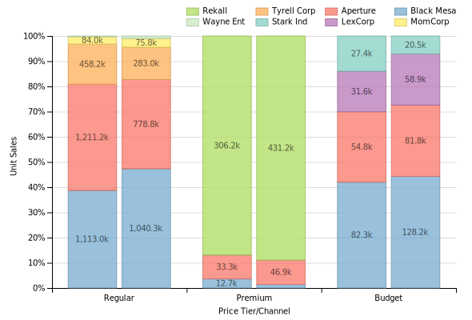
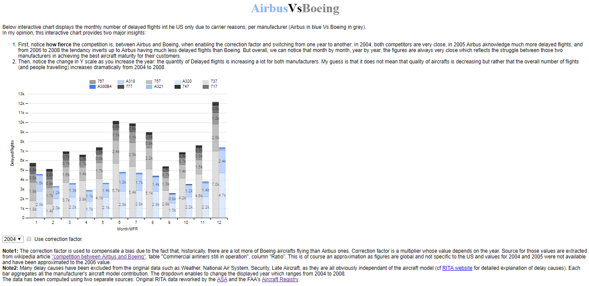
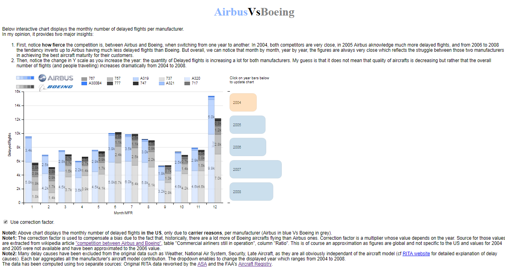

# Udacity Project: Data vizualisation using D3.js

## Summary


I work in the aerospace industry, and  I am passionate by Aircrafts. I also have always been fascinated by the fierce competition between Boeing and Airbus. I have read many articles about this topic, and a good introduction about it can be found <a href="https://en.wikipedia.org/wiki/Competition_between_Airbus_and_Boeing">here</a> on wikipedia [6]. This competition is lasting for decades and is a very popular subject: one can easily find some interesting video documentaries or books on Amazon as shown below [7], [8]:

So, I have been quite excited when reading the <a href="https://classroom.udacity.com/nanodegrees/nd002/parts/00213454010/modules/318423863275461/lessons/3184238632239847/concepts/31814787270923">"choose your data set"</a> udacity page [2] to bump into some aeronautical data.<BR>Of course I immediately choose the <a href="http://stat-computing.org/dataexpo/2009/the-data.html">ASA [3]</a>/<a href=" https://www.transtats.bts.gov/OT_Delay/OT_DelayCause1.asp">RITA [4]</a> data set which contains information on United State flight delays and performance and took the challenge to enrich it in such a way to be able to cover my favourite subject: "Airbus vs Boeing" and their respective aircrafts models.

What I want to convey in this exercise is:
- the fierce struggle between the two manufacturer achieving the best maturity for their respective aircrafts (**Note:** The aircraft maturity of an aircraft model is the mean at the entire fleet level of the percentage of time where the aircraft is flying, in contrast to AOG: Aircraft On Ground - This is an indicator of a model reliability (the more an aircraft flys, the more it generates revenues). Hence, Flight Delays can have some influence on this indicator).
- Another thing I would like to convey is the dramatic increase of the air traffic from 2004 to 2008.


## Data preparation

Although data preparation was a bit out of scope of this assignment, it was in my case one of the biggest challenge of this project:<BR>
- After having downloaded the data, <b>the first difficulty</b> I had to face was that it did not contain any reference to the Aircraft manufacturer or Aircraft model. Happily enough, I noticed a column labelled as "TailNumber". The TailNumber is for an Aircraft the equivallent of the license plate for a car. After doing a lot of research on the web, I managed to find some <a href =" https://www.faa.gov/licenses_certificates/aircraft_certification/aircraft_registry/releasable_aircraft_download/">downloadable data</a> published by the FAA [5] listing all US Aircrafts tail numbers.<BR>
- Then, <b>the second difficulty</b> was that the FAA data was coming in two parts and required some reconciliation and cleaning: On one hand was the list of all tailnumbers (what I called the masterdataframe in below code), and on the other hand was all the manufacturer data and detailed aircraft model (what I called the mfrdataframe in below code):<BR> 


```python
# import all necessary packages and functions.
import pandas as pd
from IPython.display import display
import matplotlib.pyplot as plt
import seaborn
%matplotlib inline
```


```python
# file locations
file_in_master  = '../data/MASTER2.txt'#Required to overwrite to ANSI rather than utf8 otherwise panda was lost
file_in_mfr  = '../data/ACFTREF2.txt'#Required to overwrite to ANSI rather than utf8 otherwise panda was lost

# Create a single dataframe to store all samples and differences
masterdataframe = pd.read_csv(file_in_master,sep=",",index_col=False)
mfrdataframe = pd.read_csv(file_in_mfr,sep=",",index_col=False)
print masterdataframe.columns

#Removing data out of interest
masterdataframe.drop(['OTHER NAMES(1)','OTHER NAMES(2)','OTHER NAMES(3)','OTHER NAMES(4)','OTHER NAMES(5)','Unnamed: 34'], axis=1, inplace = True)
masterdataframe.drop(['STREET2','FRACT OWNER','KIT MFR',' KIT MODEL','MODE S CODE HEX','MODE S CODE'], axis=1, inplace = True)
masterdataframe.drop(['ZIP CODE','STATE','REGION','COUNTY','COUNTRY','STATUS CODE'],axis=1, inplace = True)
masterdataframe.drop(['TYPE AIRCRAFT','TYPE ENGINE','AIR WORTH DATE','EXPIRATION DATE','CERTIFICATION'],axis=1, inplace = True)
masterdataframe.drop(['CERT ISSUE DATE','LAST ACTION DATE', 'UNIQUE ID'],axis=1, inplace = True)
masterdataframe.drop(['TYPE REGISTRANT','STREET','CITY','SERIAL NUMBER','ENG MFR MDL','NAME'],axis=1, inplace = True)
mfrdataframe.drop(['Unnamed: 11','BUILD-CERT-IND'],axis=1, inplace = True)

#Merging the two dataframes in one thanks to the "MFR MDL CODE" foreign key
masterdataframe = masterdataframe.merge(mfrdataframe,left_on='MFR MDL CODE',right_on='CODE', how='inner')
masterdataframe.drop(['MFR MDL CODE','CODE'],axis=1, inplace = True)
#Note: N-Number is the US way of calling tail number. Hence, US tail numbers have a peculiarity: They all start by 'N'.
masterdataframe['N-NUMBER'] = 'N' + masterdataframe['N-NUMBER'] #sharing same format for tailnumber to enable future merge 
masterdataframe.head(2)
```

    Index([u'N-NUMBER', u'SERIAL NUMBER', u'MFR MDL CODE', u'ENG MFR MDL',
           u'YEAR MFR', u'TYPE REGISTRANT', u'NAME', u'STREET', u'STREET2',
           u'CITY', u'STATE', u'ZIP CODE', u'REGION', u'COUNTY', u'COUNTRY',
           u'LAST ACTION DATE', u'CERT ISSUE DATE', u'CERTIFICATION',
           u'TYPE AIRCRAFT', u'TYPE ENGINE', u'STATUS CODE', u'MODE S CODE',
           u'FRACT OWNER', u'AIR WORTH DATE', u'OTHER NAMES(1)', u'OTHER NAMES(2)',
           u'OTHER NAMES(3)', u'OTHER NAMES(4)', u'OTHER NAMES(5)',
           u'EXPIRATION DATE', u'UNIQUE ID', u'KIT MFR', u' KIT MODEL',
           u'MODE S CODE HEX', u'Unnamed: 34'],
          dtype='object')
    


<div>
<table border="1" class="dataframe">
  <thead>
    <tr style="text-align: right;">
      <th></th>
      <th>N-NUMBER</th>
      <th>YEAR MFR</th>
      <th>MFR</th>
      <th>MODEL</th>
      <th>TYPE-ACFT</th>
      <th>TYPE-ENG</th>
      <th>AC-CAT</th>
      <th>NO-ENG</th>
      <th>NO-SEATS</th>
      <th>AC-WEIGHT</th>
      <th>SPEED</th>
    </tr>
  </thead>
  <tbody>
    <tr>
      <th>0</th>
      <td>N1</td>
      <td>1988</td>
      <td>GULFSTREAM AEROSPACE</td>
      <td>G-IV</td>
      <td>5</td>
      <td>5</td>
      <td>1</td>
      <td>2</td>
      <td>22</td>
      <td>CLASS 3</td>
      <td>0</td>
    </tr>
    <tr>
      <th>1</th>
      <td>N101CV</td>
      <td>1993</td>
      <td>GULFSTREAM AEROSPACE</td>
      <td>G-IV</td>
      <td>5</td>
      <td>5</td>
      <td>1</td>
      <td>2</td>
      <td>22</td>
      <td>CLASS 3</td>
      <td>0</td>
    </tr>
  </tbody>
</table>
</div>


Above join was not so easy as the data formatting was poor and I struggled hours against panda that was not able to handle utf8 encoded files. Hence I had to resave the files into ANSI. This was the only manual modification I did to the original source files.<BR>
Next step was of course to merge this fresh data to the <a href="http://stat-computing.org/dataexpo/2009/the-data.html">ASA [3]</a>/<a href=" https://www.transtats.bts.gov/OT_Delay/OT_DelayCause1.asp">RITA [4]</a> data set, and to make a few adjustments as implemented below:<BR>
- I wanted to focus on delayed flights, but from a manufacturer's or an aircraft model point of view. For example I did not care about delayed flights because of the weather, or because former flight was already delayed, as those root causes for delay were totally independant of the Aircraft model or Manufacturer. So I discarded such data.
- I also wanted to focus on Airbus Vs Boeing and discarded records related to other manufacturers.


```python
years = [2003,2004,2005,2006,2007,2008]#note: Carriers delay are monitored only from 2003 
#years = [2007]
for year in years:
    file_in_delays_by_year = "../data/{0}.csv".format(year)
    print file_in_delays_by_year
    delaybyyeardf = pd.read_csv(file_in_delays_by_year,sep=",")
    print delaybyyeardf.columns
    #delaybyyeardf.drop(['TaxiOut'],axis=1, inplace = True)
    #print delaybyyeardf.columns"
    print delaybyyeardf.shape 
    print "Keeping only records showing delay due to carrier"
    carrierDelaydf = delaybyyeardf['CarrierDelay'].map(lambda x: x>0)
    delaybyyeardf = delaybyyeardf[carrierDelaydf]
    print delaybyyeardf.shape
    print 'Removing empty Tail Numbers'
    delaybyyeardf.dropna(axis=0,how='all',subset=['TailNum'],inplace=True)
    print delaybyyeardf.shape
    print 'Merging Tail Numbers'
    delaybyyeardf = delaybyyeardf.merge(masterdataframe,left_on='TailNum',right_on='N-NUMBER', how='inner')
    print delaybyyeardf.shape
    print 'Removing manufacturers others than AIRBUS and BOEING'
    airbusRecords = delaybyyeardf['MFR'].map(lambda x: x.startswith('AIRBUS'))
    print '#Airbus: {0}'.format(airbusRecords.sum())
    boeingRecords = delaybyyeardf['MFR'].map(lambda x: x.startswith('BOEING'))
    print '#Boeings: {0}'.format(boeingRecords.sum())
    print 'Size after removal:'                                               
    delaybyyeardf = delaybyyeardf[airbusRecords | boeingRecords]
    print delaybyyeardf.shape
    delaybyyeardf.to_csv(path_or_buf= "../data/{0}_AirbusVsBoeing.csv".format(year),sep=",")
    print delaybyyeardf.tail(10)
    

```

    ../data/2007.csv
    Index([u'Year', u'Month', u'DayofMonth', u'DayOfWeek', u'DepTime',
           u'CRSDepTime', u'ArrTime', u'CRSArrTime', u'UniqueCarrier',
           u'FlightNum', u'TailNum', u'ActualElapsedTime', u'CRSElapsedTime',
           u'AirTime', u'ArrDelay', u'DepDelay', u'Origin', u'Dest', u'Distance',
           u'TaxiIn', u'TaxiOut', u'Cancelled', u'CancellationCode', u'Diverted',
           u'CarrierDelay', u'WeatherDelay', u'NASDelay', u'SecurityDelay',
           u'LateAircraftDelay'],
          dtype='object')
    (7453215, 29)
    Keeping only records showing delay due to carrier
    (814922, 29)
    Removing empty Tail Numbers
    (814922, 29)
    Merging Tail Numbers
    (560291, 40)
    Removing manufacturers others than AIRBUS and BOEING
    #Airbus: 97912
    #Boeings: 184650
    Size after removal:
    (282562, 40)
            Year  Month  DayofMonth  DayOfWeek  DepTime  CRSDepTime  ArrTime  \
    560281  2007     12          22          6    947.0         920   1131.0   
    560282  2007     12          26          3    759.0         735   1010.0   
    560283  2007     12          27          4    207.0          55    738.0   
    560284  2007     12          27          4    836.0         805   1225.0   
    560285  2007     12          29          6   1252.0        1200   1531.0   
    560286  2007     12          29          6    842.0         805   1211.0   
    560287  2007     12          22          6   2238.0        2205    126.0   
    560288  2007     12          22          6   1206.0        1145   1508.0   
    560289  2007     12          20          4   1653.0        1625   2016.0   
    560290  2007     12           2          7   1646.0        1635   2008.0   
    
            CRSArrTime UniqueCarrier  FlightNum  ...   YEAR MFR  \
    560281        1049            B6         68  ...       2007   
    560282         950            B6        331  ...       2007   
    560283         624            B6         98  ...       2007   
    560284        1148            B6        177  ...       2007   
    560285        1446            B6         12  ...       2007   
    560286        1120            B6         19  ...       2007   
    560287          40            CO        793  ...       1998   
    560288        1424            CO        693  ...       1998   
    560289        1924            CO         51  ...       1998   
    560290        1930            DL        147  ...       1997   
    
                                       MFR                 MODEL  TYPE-ACFT  \
    560281  AIRBUS                          A320-232                      5   
    560282  AIRBUS                          A320-232                      5   
    560283  AIRBUS                          A320-232                      5   
    560284  AIRBUS                          A320-232                      5   
    560285  AIRBUS                          A320-232                      5   
    560286  AIRBUS                          A320-232                      5   
    560287  BOEING                          777-224                       5   
    560288  BOEING                          777-224                       5   
    560289  BOEING                          777-224                       5   
    560290  BOEING                          767-332                       5   
    
            TYPE-ENG  AC-CAT NO-ENG NO-SEATS  AC-WEIGHT  SPEED  
    560281         5       1      2      200    CLASS 3      0  
    560282         5       1      2      200    CLASS 3      0  
    560283         5       1      2      200    CLASS 3      0  
    560284         5       1      2      200    CLASS 3      0  
    560285         5       1      2      200    CLASS 3      0  
    560286         5       1      2      200    CLASS 3      0  
    560287         5       1      2      400    CLASS 3      0  
    560288         5       1      2      400    CLASS 3      0  
    560289         5       1      2      400    CLASS 3      0  
    560290         5       1      2      330    CLASS 3      0  
    
    [10 rows x 40 columns]
    

Thanks to all previous steps, I was able to get a rich data set enabling a lot of possibilities. However, the original data set was more than 10 Go, and the resulting one was still 1Go, so not quite appropriate to visualize on the web in js and was requiring some further data cleansing.
So I took the choice to focus on the actual number of delayed flights by year, month, manufacturer & model and to discard most of others columns (hence the final groupby and count).


```python
years = [2004,2005,2006,2007,2008]#note: Carriers delay are monitored on a whole year only from 2004
df = pd.DataFrame()
for year in years:
    file_in_aggregated  = '../data/{0}_AirbusVsBoeing.csv'.format(year)
    airbvsboeing = pd.read_csv(file_in_aggregated,sep=",")
    print "Removing AIRBUS HELICOPTERS & BOEING CH (Chinook) & BOEING A75N1:"
    ishelicodf = airbvsboeing['MFR'].map(lambda x: not x.startswith('AIRBUS HELICOPTERS'))
    airbvsboeing = airbvsboeing[ishelicodf]
    ishelicodf = airbvsboeing['MODEL'].map(lambda x: not x.startswith('CH'))
    airbvsboeing = airbvsboeing[ishelicodf]
    ishelicodf = airbvsboeing['MODEL'].map(lambda x: not x.startswith('A75N1'))
    airbvsboeing = airbvsboeing[ishelicodf]
    print "Merging AIRBUS and AIRBUS INDUSTRIE:"
    airbvsboeing['MFR'] = airbvsboeing['MFR'].map(lambda x: 'AIRBUS' if x.startswith('AIRBUS') else x)
    airbvsboeing['MFR'] = airbvsboeing['MFR'].map(lambda x: 'BOEING' if x.startswith('BOEING') else x)
    print "Merging MODELS A3XX-* and 7XX-*:"
    airbvsboeing['MODEL'] = airbvsboeing['MODEL'].map(lambda x: x.split('-',1)[0])
    #Groupby MFR/MODEL and
    airbvsboeing = airbvsboeing[["Year", "Month", "MFR","MODEL","DepTime"]].groupby(["Year", "Month", "MFR","MODEL"]).count().rename(columns = {'DepTime':'DelayedFlights'})
    airbvsboeing.to_csv(path_or_buf= "../data/{0}_AirbusVsBoeingWeb.csv".format(year),sep=",")
    df = df.append(airbvsboeing)
df.to_csv(path_or_buf= "../data/AirbusVsBoeingWeb.csv",sep=",")
```

    C:\Anaconda2\lib\site-packages\IPython\core\interactiveshell.py:2723: DtypeWarning: Columns (31) have mixed types. Specify dtype option on import or set low_memory=False.
      interactivity=interactivity, compiler=compiler, result=result)
    

    Removing AIRBUS HELICOPTERS & BOEING CH (Chinook) & BOEING A75N1:
    Merging AIRBUS and AIRBUS INDUSTRIE:
    Merging MODELS A3XX-* and 7XX-*:
    Removing AIRBUS HELICOPTERS & BOEING CH (Chinook) & BOEING A75N1:
    Merging AIRBUS and AIRBUS INDUSTRIE:
    Merging MODELS A3XX-* and 7XX-*:
    Removing AIRBUS HELICOPTERS & BOEING CH (Chinook) & BOEING A75N1:
    Merging AIRBUS and AIRBUS INDUSTRIE:
    Merging MODELS A3XX-* and 7XX-*:
    Removing AIRBUS HELICOPTERS & BOEING CH (Chinook) & BOEING A75N1:
    Merging AIRBUS and AIRBUS INDUSTRIE:
    Merging MODELS A3XX-* and 7XX-*:
    Removing AIRBUS HELICOPTERS & BOEING CH (Chinook) & BOEING A75N1:
    Merging AIRBUS and AIRBUS INDUSTRIE:
    Merging MODELS A3XX-* and 7XX-*:
    

This resulted in a clean and light single csv data file of 17Ko with 789 records, appropriate to start with the project.


```python
df.describe()
```


<div>
<table border="1" class="dataframe">
  <thead>
    <tr style="text-align: right;">
      <th></th>
      <th>COUNT</th>
    </tr>
  </thead>
  <tbody>
    <tr>
      <th>count</th>
      <td>789.000000</td>
    </tr>
    <tr>
      <th>mean</th>
      <td>1392.618504</td>
    </tr>
    <tr>
      <th>std</th>
      <td>2316.471480</td>
    </tr>
    <tr>
      <th>min</th>
      <td>1.000000</td>
    </tr>
    <tr>
      <th>25%</th>
      <td>56.000000</td>
    </tr>
    <tr>
      <th>50%</th>
      <td>536.000000</td>
    </tr>
    <tr>
      <th>75%</th>
      <td>1887.000000</td>
    </tr>
    <tr>
      <th>max</th>
      <td>20148.000000</td>
    </tr>
  </tbody>
</table>
</div>


## Design
I got inspired by the <a href="http://dimplejs.org/advanced_examples_viewer.html?id=advanced_bar_labels"> advanced bar labels</a> from the advanced example of the Dimple.js web site [9].<BR><BR> I found it very convenient to represent categorical data (in my case Airbus category Vs Boeing category) and to allow some comparison between them. Although bar charts look simple, this one enables to catch a lot of information in a simple glimpse.<BR> What I liked a lot also, was the visual encoding (thanks to color and legend) of each aggregated subcategory contribution within its parent category, along with the labels providing the exact figures: In my opinion, this was the ideal way to represent the importance of **each aircraft model** for a given manufacturer on my data (Number of Delayed flights) in a very **readable** and straightforward way.<BR> Finally, the last feature I appreciated, were the tooltips when hovering over the data.<BR>
However, what I missed a little bit from this example, was a bit of animation and a bit of interactivity. This is where I had to put some efforts for the sake of this exercise:<BR>
In term of **narrative**, my goal was to show some sort of struggle, with one competitor leading, the other one closely following to recover the situation and eventually exceeding the other one. To represent such struggle I needed to introduce some kind of temporality. 
- First, I enabled a static comparison between Airbus & Boeing for every single month in a given year. 
- Then, as I wanted to emphasis on above mentioned scenario, this is where I introduced interactivity & animation: I implemented a dropdown control to let the user change the year with an animated transition. I was expecting that the leadership would change from one year to another.

## Feedback
#### My wife's feedback
The first early design I shown to my wife in order to get some feedback was as follows:<BR><BR> I spent a considerable amount of time to introduce the interactive dropdown and forgot a little bit about the basics:
- Indeed, she highlighted that, despite the legend showing clearly the aircraft models, the colors between Airbus & Boeing were too similar and did not enable to distinguish clearly between the two of them. Besides, not everybody knows which Aircraft model belongs to which manufacturer. To take into account her feedback, I modified the legend to have shade of greys for Boeing aircrafts and shade of blue for Airbus aircrafts. This brought a lot of clarity and visual consistency to the design and enabled not to get lost during the animated transitions.
- Another point she made, was that the chart was simply missing a title. It did not take long to find the "Airbus Vs Boeing" punch line, also used a lot in the medias. I also reflected the color choice in this title to make things even clearer.<BR>

#### My colleagues's feedback
I then proposed my resulting design to a colleague of mine also working in Aerospace industry:<BR> She mentioned that comparing raw numbers (here, the amount of delayed flights) from Airbus & Boeing in the US was not very fair (Airbus was systematically showing less delayed flights than Boeing) and was introducing some bias. Actually, Boeing had some monopoly for many years and sold a huge number of aircrafts in the local market without competition. So, even if Airbus is doing good today and produces yearly about the same number of aircrafts, it started clearly as challenger and it was not able to penetrate the US market right from the beginning. This lead to having far more Boeing A/C flying in the US than Airbus ones. To compensate this bias I tried to find some corrective ratio whose value would depend on the year. I found such values from the wikipedia article <a href="https://en.wikipedia.org/wiki/Competition_between_Airbus_and_Boeing">"competition between Airbus and Boeing"</a>, table "Commercial airliners still in operation", column "Ratio". This is of course an approximation as figures are global and not specific to the US and values for 2004 and 2005 were not available and have been approximated to the 2006 value. But this enabled to add some kind of interactivity to the chart and brought what I was looking for, namely this idea of struggle, with close competitors fighting each other.<BR><BR>
#### My Son's feedback
The last feedback I collected was from my son:<BR><BR> It was rather laconic but quite useful in the end. He said "it's good but there is too much bla bla". This made me realize that rather than going straight to the point with this idea of struggle/competition, the very first text coming with the chart was about citing sources and explaining correction factor. So I decided to move upward the message I wanted to convey in order to have it first, which leaded to the much more meaningful below submission:

#### The 1rst Udacity reviewer feedback
The reviewer advised to add some additional legend regarding Airbus & Boeing. He also mentioned to get the corection factor activated by default to make it more simple for a user to get the messages. Then he advised to reduce the leading text details, going straight to the point. Finally, he advised to improve the navigation by year (As per a Dimple.js advanced example shown <a href="http://dimplejs.org/advanced_examples_viewer.html?id=advanced_storyboard_control">here</a>). All those changes have been implemented in the very final submission below and makes the final result very appealing:


## Resources
Original assignment from udacity & data sources:<BR>
[1] Udacity project page https://classroom.udacity.com/nanodegrees/nd002/parts/00213454010/modules/318423863275461/lessons/3184238632239847/concepts/31814787270923<BR>
[2] Udacity data choice
https://docs.google.com/document/d/1w7KhqotVi5eoKE3I_AZHbsxdr-NmcWsLTIiZrpxWx4w/pub?embedded=true<BR>
[3] ASA http://stat-computing.org/dataexpo/2009/the-data.html<BR>
[4] RITA https://www.transtats.bts.gov/OT_Delay/OT_DelayCause1.asp<BR>
[5] FAA's Aircraft Registry https://www.faa.gov/licenses_certificates/aircraft_certification/aircraft_registry/releasable_aircraft_download/<BR>
[9] Dimple.js advanced examples http://dimplejs.org/advanced_examples_viewer.html?id=advanced_bar_labels<BR><BR>

Background information on AirbusVsBoeing and investigated dataset:<BR>
[6] Wikipedia "Competition Between Airbus & Boeing" https://en.wikipedia.org/wiki/Competition_between_Airbus_and_Boeing<BR>
[7] Boeing vs Airbus on Amazon https://www.amazon.com/Boeing-versus-Airbus-International-Competition/dp/1400078725<BR>
[8] Birds of prey on Amazon https://www.amazon.com/Birds-Prey-Boeing-Airbus-Battle/dp/1568581076/ref=sr_1_1?s=books&ie=UTF8&qid=1497731569&sr=1-1&keywords=birds+of+prey+boeing<BR>
[10] Airbus & Boeing logos: Google Image


**Revisions:**<BR>
    [1] - Saturday the 17th of June, original submission <BR>
    [2] - Friday the 22th of June, after 1st reviewer feedback.
